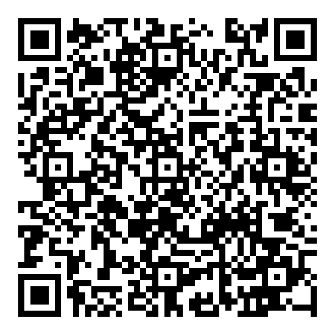
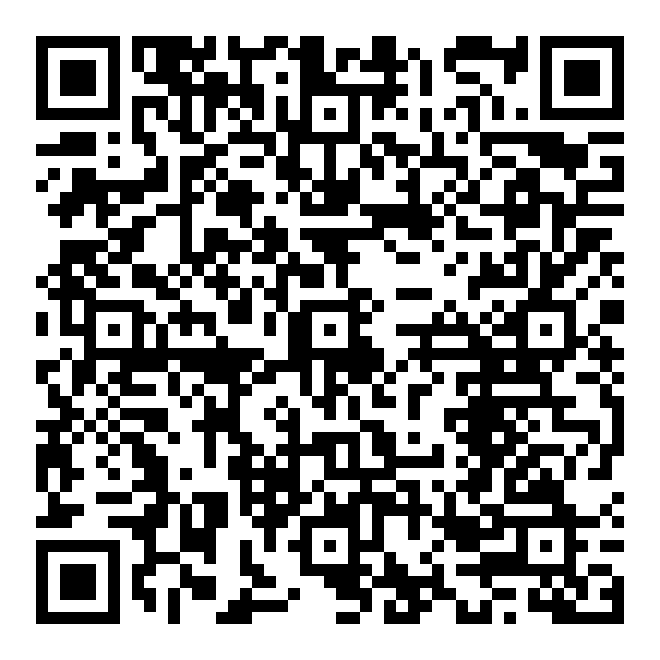

# 開課前準備｜帳號申請

> 現場只登入、不註冊。十八個人同時辦帳號會吃掉半堂課，所以**務必在課前完成**。
> 辦好之後回來對照本頁的「檢查方式」，確認能登入才算完成。

## 總覽

| 帳號 | 用途 | 需要等信嗎 | 課前必辦 |
|---|---|---|---|
| Google 帳號 | 登入 Antigravity（本機開發工具）、使用 AI 助手 | 不用 | **是** |
| GitHub 帳號 | 存放兩天的成果 | 不用（但要驗證信箱） | **是** |
| 群益期貨模擬帳號（QIT） | 看國內期貨與選擇權的實際報價 | **要**，等 Email | **是，務必提早辦** |
| 群益外匯美股模擬帳號（CTA） | 看外匯與海外商品報價、使用 EvoCode | **要**，等 Email | **是，務必提早辦** |

> 兩個群益帳號是**不同平台**：期貨走 **QIT**，外匯與美股走 **CTA**（EvoCode 在 CTA 上）。
> 兩個都申請，兩天課程都會用到。

---

## 一、Google 帳號

**為什麼要辦**：這兩天在本機用 Antigravity（或 Cursor）這套 IDE 寫程式，登入方式是
Google 帳號；IDE 裡的 AI 助手也是同一個帳號授權使用。

**怎麼辦**：
1. 已有 Gmail 或其他 Google 帳號的同學可以直接用，不用另外申請。
2. 沒有的話到 [accounts.google.com/signup](https://accounts.google.com/signup) 申請一個新帳號。

**辦好的檢查方式**：
1. 能用這個帳號登入 [accounts.google.com](https://accounts.google.com)。
2. 記得帳號密碼，開課當天登入 Antigravity 會用到（詳見
   [`02-環境設定.md`](02-環境設定.md)）。

---

## 二、GitHub 帳號

**為什麼要辦**：兩天做出來的東西（程式、資料、報告）都要存進 GitHub 倉庫才帶得走——
教室電腦有還原系統，下課就會清空，存在電腦桌面等於白做。GitHub 帳號是這兩天成果的家。

**怎麼辦**：
1. 到 [github.com/signup](https://github.com/signup) 註冊。
2. 需要一個可以收信的信箱（會寄驗證信，務必完成信箱驗證這一步）。
3. 註冊過程有人機驗證，跟著畫面指示做完即可。
4. 使用者名稱建議用真實姓名或學號相關的英文／數字組合，方便組員與老師辨認。

**辦好的檢查方式**：
1. 能用剛註冊的帳號登入 [github.com](https://github.com)。
2. 登入後右上角看得到自己的頭像與使用者名稱。

> 課堂上第一個實作動作就是「組長開一個新倉庫、把組員加進去」，
> 詳細步驟見 [`02-環境設定.md`](02-環境設定.md)。

---

## 三、群益模擬帳號（兩個都要辦）

**為什麼要辦**：這門課的特色是與產業實務結合。你會用**真實的券商報價**做出每天可以跑的
觀察工具，而不是只看歷史資料寫報告。模擬帳號讓你看到實際的商品報價與交易介面，
**不會用到真的錢**，純粹是教學與資料存取用途。

兩個平台分工不同，**兩個都要申請**：

### 3-1　期貨模擬帳號（QIT 平台）

國內期貨與選擇權報價。申請網址：

`https://www.capitalfutures.com.tw/zh-tw/simulatedtrading/qit?empno=a97157`

**申請流程**（三步驟）
1. 填姓名、電子郵件、手機號碼、圖形驗證碼，勾選同意條款後送出。
2. 完成手機簡訊驗證後，**帳號與密碼會寄到你填的信箱**。
3. 下載 QIT 平台（電腦版／iOS／Android 都有），用收到的帳密登入。

### 3-2　外匯美股模擬帳號（CTA 平台，EvoCode 在這裡）

外匯、海外指數、美股 CFD 報價，以及 **EvoCode**（用 C# 寫自訂技術指標的環境）。
申請網址：

`https://cfmt.capitalfutures.com.tw/zh-TW/DemoAccount/Apply?sid=A97157#reg`

**申請流程**
1. 填寫申請表，完成簡訊驗證，勾選個資同意書後送出。
2. **至信箱收取交易帳號**。
3. 安裝群益交易王 CTA 電腦版（見 [`02-環境設定.md`](02-環境設定.md)），用收到的帳密登入。

### 檢查方式（兩個帳號都要確認）

1. 信箱收到群益寄來的帳號通知信，裡面有帳號與密碼（或設定密碼的連結）。
2. 能用這組帳號登入對應的平台，看得到商品報價在跳動。

> ⚠️ 這兩個申請都要**等 Email**，不是填完就有。
> 現場才辦會等不到信，整堂課會卡住——**請務必課前辦好**。

## 帳號都辦好之後

回到 [README](../README.md) 確認自己已經完成開課前的三件事，再往下看
[`02-環境設定.md`](02-環境設定.md) 熟悉第一天現場要做的環境設定步驟。
